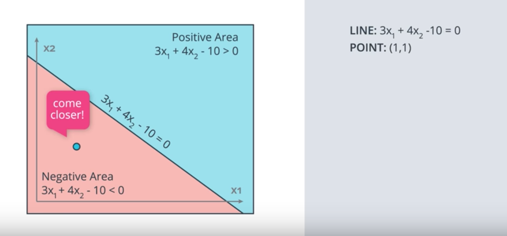

# Perceptron Trick

Use the mathematical trick you learned in class that modifies the equation of the line 3x1+4x2-10 = 0, in order to reach the misclassified point position at (1,1) coordinates. For this trick you have to use a learning rate of 0.1.

How many times would you have to apply the perceptron trick to move the line to a position where the point (1,1), is correctly classified?

