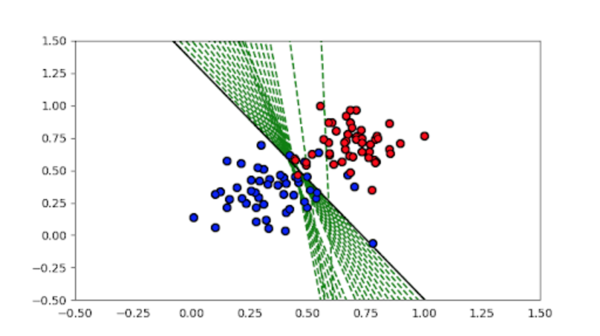

# Perceptron Algorithm

Time to code! In this quiz, you'll have the chance to implement the perceptron algorithm to separate the following data (given in the file `data.csv`). Initial given code for the perceptron can be found in `perceptron.py`.

Recall that the perceptron step works as follows. For a point with coordinates  $(p,q)$, label $y$, and prediction given by the equation $\hat{y} = step(w_1x_1 + w_2x_2 + b)$:
* If the point is correctly classified, do nothing.
* If the point is classified positive, but it has a negative label, subtract $\alpha p, \alpha q$ and $\alpha$ from $w_1, w_2$​, and $b$ respectively.
* If the point is classified negative, but it has a positive label, add $\alpha p, \alpha q$ and $\alpha$ to $w_1, w_2$, and $b$ respectively.

**My solution plotted below**

